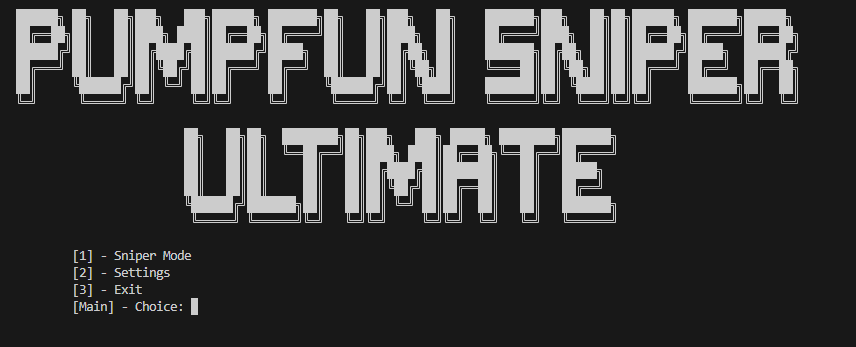
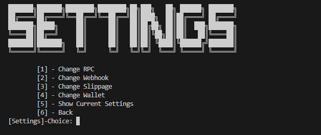
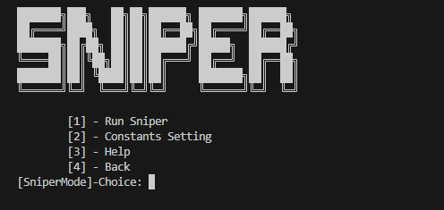
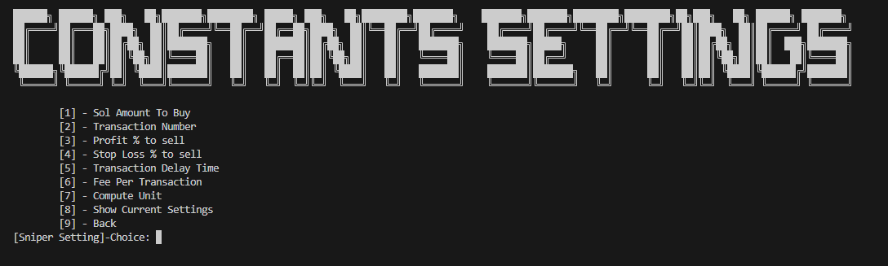
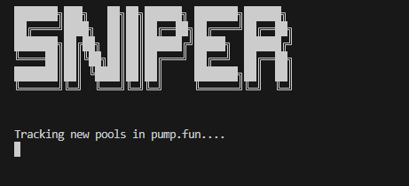
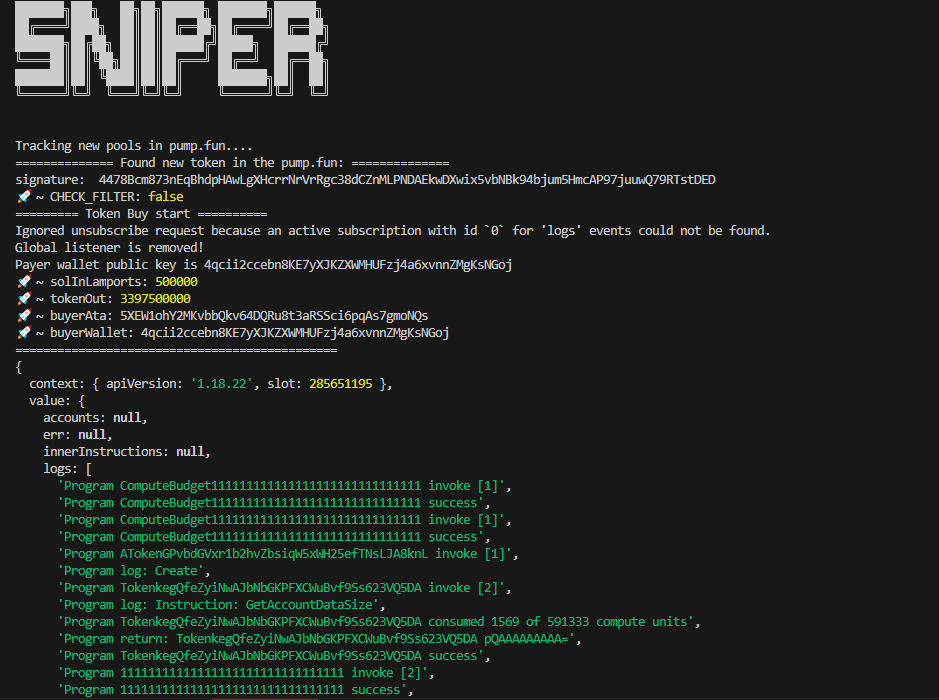
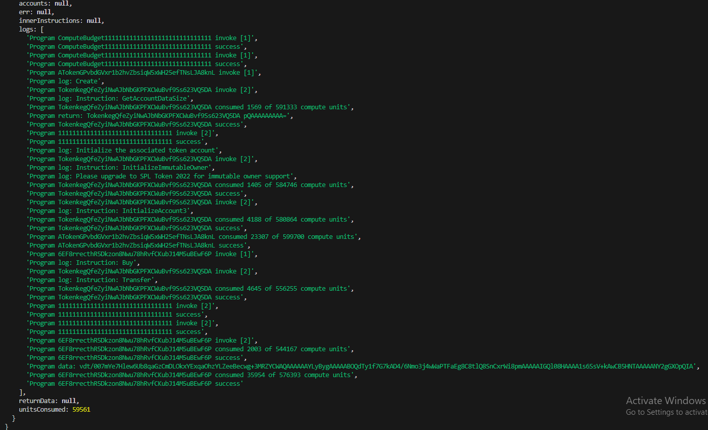
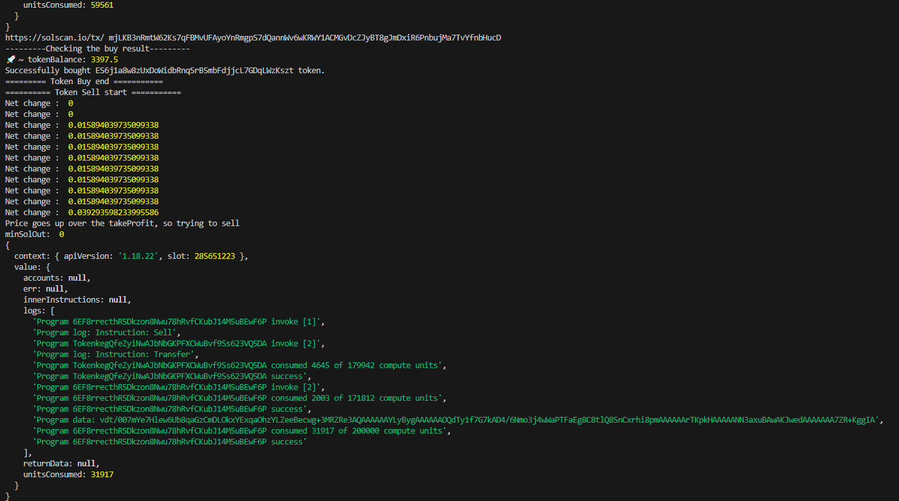
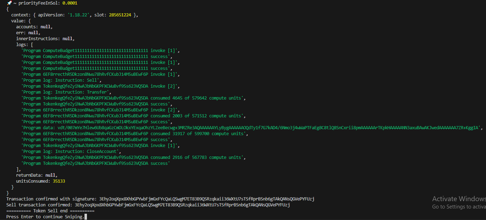

# How Can I snipe the token in Pump.fun?
# Solana pumpfun sniper

This is the first screen of the my Sniper.

This is the settings of my sniper.
You can set these constants.

This is the sniper mode of my sniper.

This is the constants settings of the sniper.
You can set these constants.

This is the starting of the sniper.

These are the steps of the sniping process.

This public version is only buy part of my sniper.
You can test it how fast it is to snipe the new tokens in Pump.fun sniper.
If you are satisfied with this, then you can contact me and get whole part of my sniper.
Contact info
telegram: @Takhi77

After the contact through telegram, then let's continue through other media.
